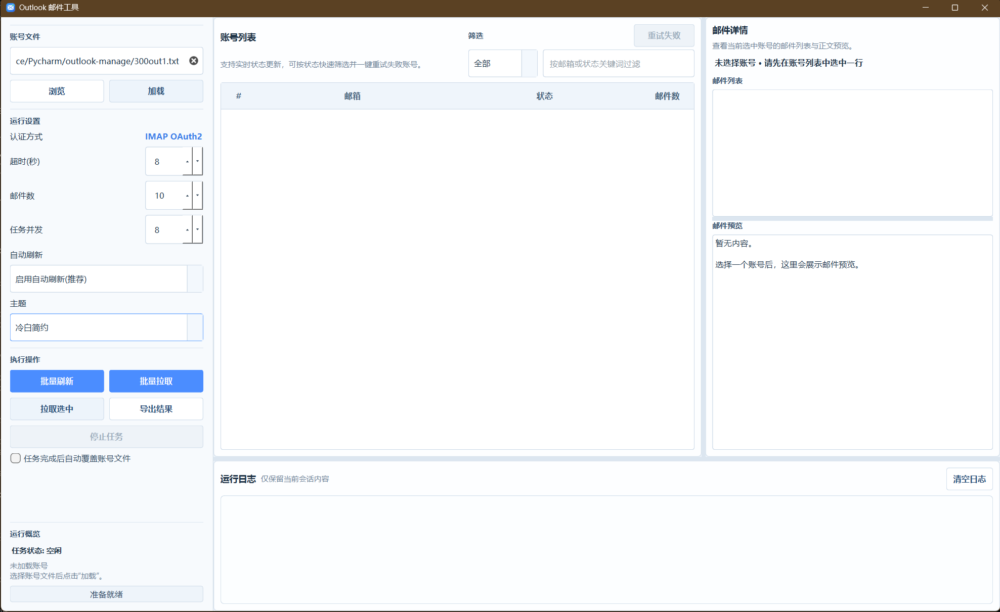
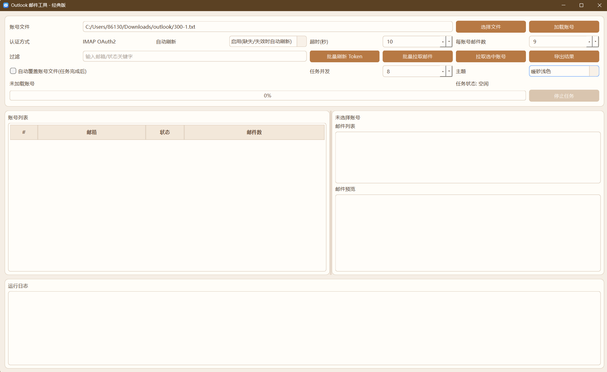

# Outlook Management Releases

> 中文在前，English below.

## 中文

`Outlook Management Releases` 是 `Outlook Management` 的成品发布仓库，仅用于分发可执行版本，不包含源代码。

### 快速入口
- 仓库主页：<https://github.com/kieranchan/outlook-management-releases>
- 最新发布：<https://github.com/kieranchan/outlook-management-releases/releases/latest>
- 当前版本：`v1.0.0`

### 当前提供
- 安装版（推荐普通用户）
- 新版便携版（推荐）
- 经典版便携版（备用）
- 发布说明 `RELEASE_NOTES.md`
- 校验文件 `SHA256SUMS.txt`

### 下载建议
- 普通用户：优先下载 `outlook-management-setup-v1.0.0.exe`
- 想免安装运行：下载新版 zip
- 需要兼容或回退：下载经典版 zip

### 版本选择
- 安装版：双击安装即可使用，会创建开始菜单项，并可选创建桌面快捷方式。
- 新版：默认推荐，使用 Qt 左中右主布局，支持多主题、窗口状态记忆、批量操作与并发拉取邮件。
- 经典版：保留为稳定备用版本，适合兼容、回退或偏好旧界面的场景。

### 界面预览

<table>
  <tr>
    <th>新版 / Modern</th>
    <th>经典版 / Classic</th>
  </tr>
  <tr>
    <td></td>
    <td></td>
  </tr>
</table>

### 使用方法
1. 打开 **Releases** 页面。
2. 普通用户下载安装版 `Setup.exe`，双击安装。
3. 如需免安装运行，下载对应 zip 并完整解压。
4. 运行安装后的快捷方式或解压目录中的 `.exe`。

### 注意事项
- 安装版更适合大多数用户，不需要手动管理整套文件。
- 便携版请保留完整解压后的目录结构，不要只单独拿出 `.exe` 文件运行。
- 一般情况下优先选择新版。
- 如果新版在你的环境中出现兼容问题，可切换到经典版。
- 本仓库不提供源代码，仅提供可直接运行的发布成品。

### 完整性校验
可使用 `SHA256SUMS.txt` 校验下载文件是否完整一致。

---

## English

`Outlook Management Releases` is the release-only distribution repository for `Outlook Management`.
It provides packaged binaries only and does **not** include source code.

### Quick Links
- Repository: <https://github.com/kieranchan/outlook-management-releases>
- Latest release: <https://github.com/kieranchan/outlook-management-releases/releases/latest>
- Current version: `v1.0.0`

### Available Downloads
- Installer edition (recommended for most users)
- Modern portable edition (recommended)
- Classic portable edition (fallback)
- Release notes in `RELEASE_NOTES.md`
- Checksum file in `SHA256SUMS.txt`

### Download Guidance
- Most users: download `outlook-management-setup-v1.0.0.exe`
- Portable usage: download the modern zip package
- Compatibility or rollback: download the classic zip package

### Edition Guide
- Installer edition: double-click to install, adds Start Menu entries, and can optionally create desktop shortcuts.
- Modern edition: recommended by default, uses the Qt three-panel layout and supports themes, window state persistence, batch actions, and concurrent mail fetching.
- Classic edition: kept as a stable fallback for compatibility, rollback, or users who prefer the older interface.

### UI Preview
The screenshots above show the modern and classic editions side by side.

### How to Use
1. Open the **Releases** page.
2. Most users should download the installer `Setup.exe` and install it directly.
3. If you prefer portable usage, download the corresponding zip package and extract it fully.
4. Run the installed shortcut or the `.exe` inside the extracted folder.

### Notes
- The installer edition is the easiest option for most users.
- For portable packages, keep the full extracted folder structure intact. Do not run the `.exe` alone after separating it from its folder.
- For normal use, the modern edition is recommended.
- If you encounter compatibility issues with the modern edition, use the classic edition.
- This repository distributes binaries only and does not include source code.

### Verification
Use `SHA256SUMS.txt` to verify download integrity.
